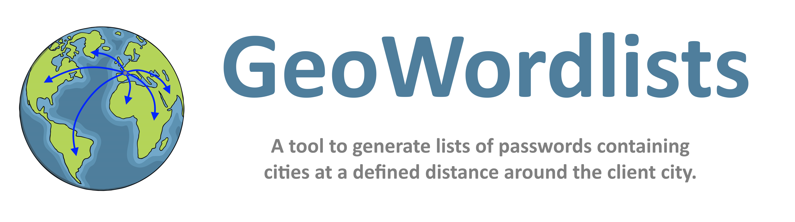

<p align="center">
  
  
  <a href="https://twitter.com/intent/follow?screen_name=podalirius_" title="Follow"></a>
  <a href="https://www.youtube.com/c/Podalirius_?sub_confirmation=1" title="Subscribe"></a>
  <br>
</p>

## Currently supported countries
 - 🇫🇷 France

## Usage

```
$ ./GeoWordlists.py -h
GeoWordlists.py v1.0.1 - by @podalirius_

usage: GeoWordlists.py [-h] [-v] [--debug] [-k KILOMETERS] [-o OUTPUT_FILE] -p POSTAL_CODE [--no-variant]

options:
  -h, --help            show this help message and exit
  -v, --verbose         Verbose mode. (default: False)
  --debug               Debug mode.
  -k KILOMETERS, --kilometers KILOMETERS
                        Search radius in kilometers around the client city.
  -o OUTPUT_FILE, --output-file OUTPUT_FILE
                        Output file containing the generated wordlist.
  -p POSTAL_CODE, --postal-code POSTAL_CODE
                        Postal code of the client city.
  --no-variant          Will not use any variant and only output the name of the city.
```

## Example

If you want to generate the list of probable passwords around `75001 Paris 01` with a radius of `25` kilometers:

```
$ ./GeoWordlists.py -p 75001 -k 25 -o ./around_paris.txt
GeoWordlists.py v1.0.1 - by @podalirius_

[>] Using client city in [75001:Paris 01] at (48.862549876, 2.336419316), FRANCE
[>] Generated 1292 passwords sorted by probability
[+] Written 'around_paris.txt' (20721 bytes)
```

## Contributing

Pull requests are welcome. Feel free to open an issue if you want to add other features.
